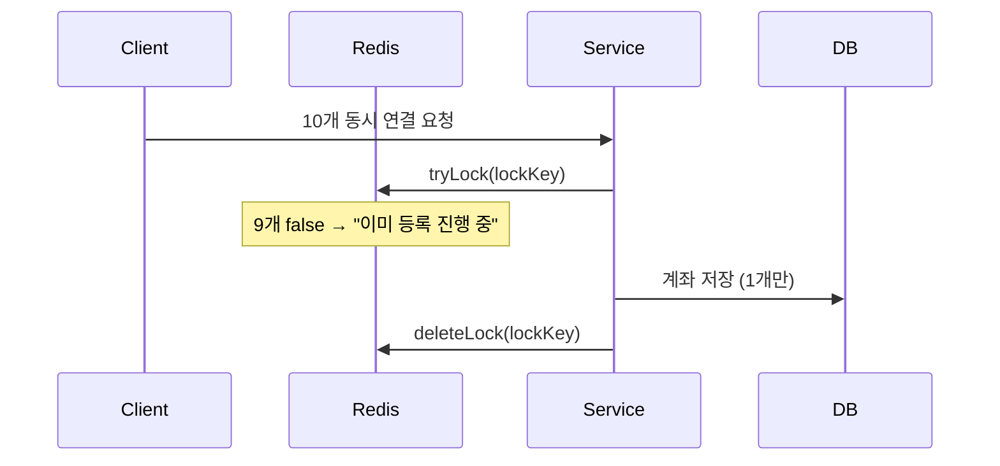

# 송금 서비스 구현
## 프로젝트 실행

1. MySQL + Redis + 앱 컨테이너 실행
  ```bash
   docker compose up -d
  ```
2. 앱 상태 확인
  ```bash
    docker compose logs -f
  ```
3. API 테스트 
- http/account-api.http, http/transaction-api.http 실행
  ```bash
  ./gradlew bootRun
  ```
  
### Swagger
> http://localhost:8080/swagger-ui/index.html#/
> 
### Dependency
- `Docker Compose 1.6.0+`
- `JDK 17`

## 프로젝트 개요
### 데이터 모델링
- 계좌(Account)를 상위 자원으로 거래(Transaction)를 하위 자원으로 계층화
### 관심사
- account 모듈: 계좌 관리
  - 생성
  - 삭제
  - 조회
- transaction 모듈: 거래 관리 
  - 입금
  - 출금
  - 송금
  ```text
  com.example.banktransfer
  ├── account
  │   ├── Account.java (엔티티)
  │   ├── AccountService.java (CRUD)
  │   └── AccountRepository.java
  │
  └── transaction
  ├── Transaction.java (엔티티)
  ├── TransactionService.java (입금/출금/이체)
  └── TransactionRepository.java
  ```

### 아키텍처 및 동시성 제어 전략
1. 계좌 등록 및 삭제
```text
문제: 동시 10개 요청 → 외부 API 10회 호출 → 계좌 10개 중복 등록
해결: Redis 분산 락 (setIfAbsent NX EX 5분)
```



결과: accountRepository.count() == 1, success=1, rejected=9

2. 이체/입금/출금
```text
문제: 동시 출금 → Lost Update (잔고 불일치)
해결: JPA @Version + Optimistic Lock 재시도
```

```java
@Version
private Long version;

optimisticLockingRetryExecutor.run(() -> {
    account.withdraw(amount); // version 증가
    accountRepository.save(account); // 충돌 시 OptimisticLockException → 재시도
});
```
결과: 동시 1000개 입금 → 잔고 정확히 1000배 증가

### 비즈니스 예외 계층 구조
```text
BusinessException (RuntimeException)
├── AccountException
│   ├── AccountClosedException → ACCOUNT_CLOSED (409)
│   ├── AccountAlreadyLinkedException → ACCOUNT_ALREADY_LINKED (409)
│   └── InsufficientBalanceException → INSUFFICIENT_BALANCE (400)
└── TransactionException
├── TransferLimitExceededException → TRANSFER_LIMIT_EXCEEDED (400)
└── TransferInProgressException → TRANSFER_IN_PROGRESS (409)
```
- 핸들러 1개로 모든 예외 처리

=> 추가 custom exception 구현 시 코드 수정 범위 최소화하도록 설계